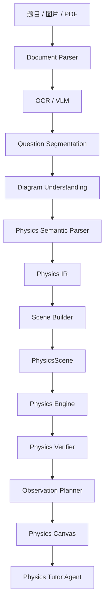
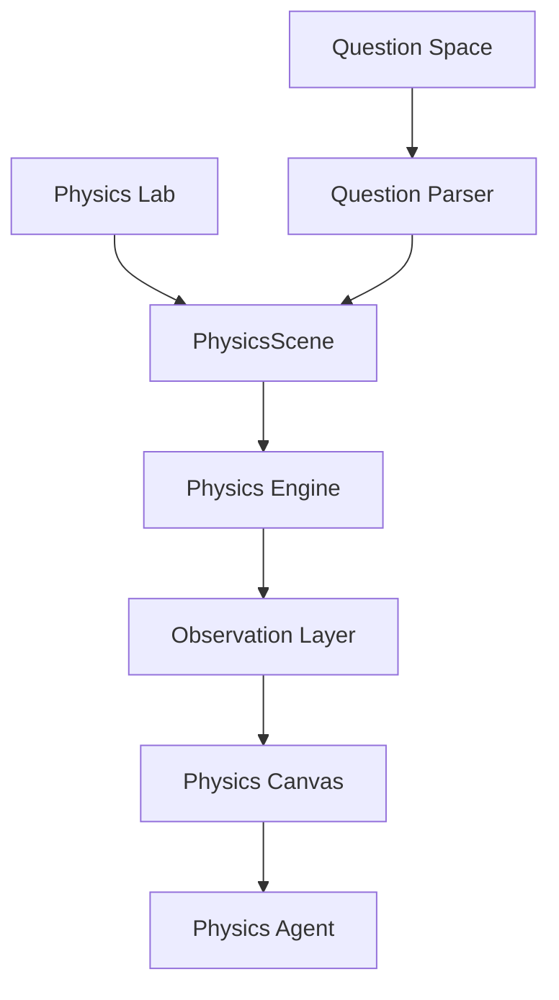
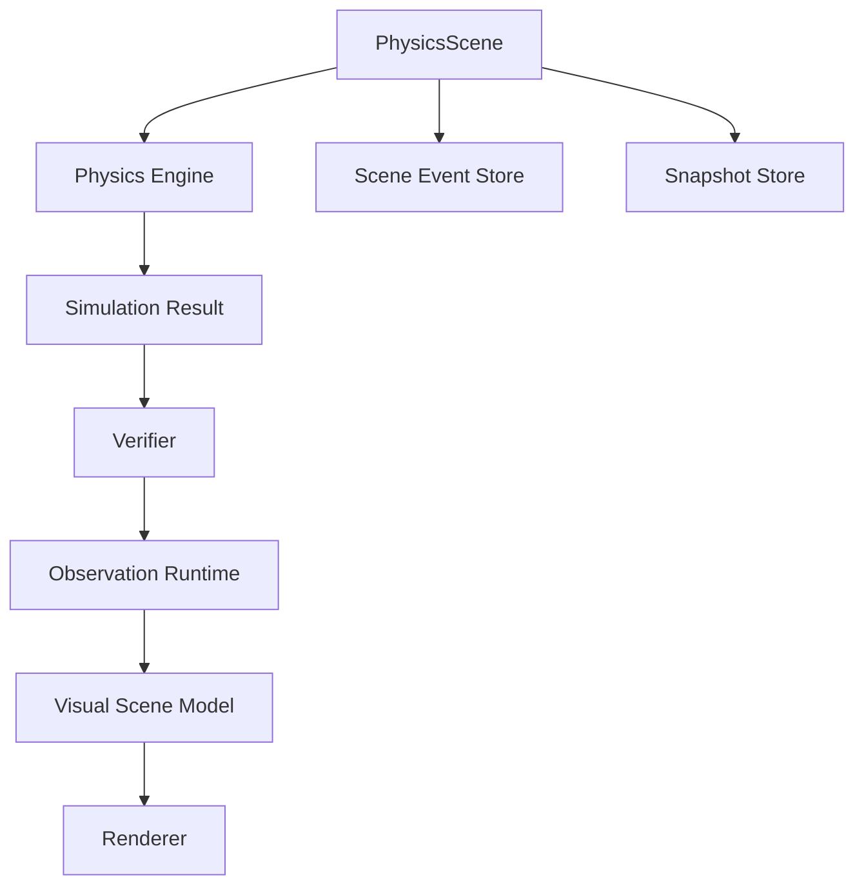
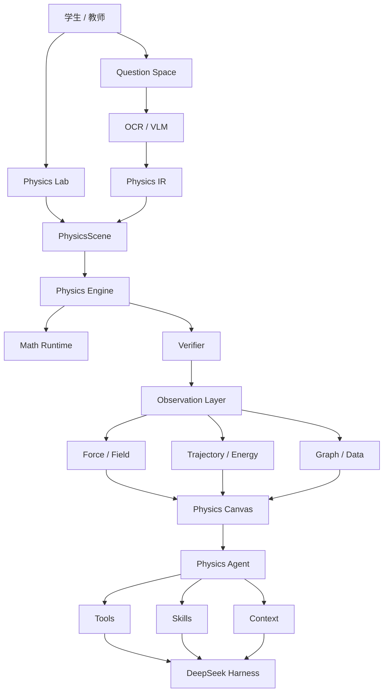

# PhysicsOS 产品总览与系统架构

> 文件：`docs/00-PRODUCT-OVERVIEW.md`  
> 文档定位：PhysicsOS 完整产品定义与系统架构  
> **版本定位：完整版产品架构 / Web First**
>
> **产品类型：初高中物理可视化推演 + AI Agent 学习平台**
>
> **核心理念：让看不见的物理过程被看见。**

---

# 1. 产品概述

## 1.1 产品名称

**PhysicsOS**

中文定位：

> **初高中物理可视化推演与 Agent 平台**

PhysicsOS 不是传统意义上的 AI 搜题网站，也不是播放固定动画的虚拟实验平台。

它希望解决物理学习过程中最本质的一类问题：

> 很多物理概念不是学生“不会公式”，而是学生根本没有真正看见物理过程。

例如：

* 物体究竟受到哪些力；
* 合力为什么指向这个方向；
* 速度与加速度如何动态变化；
* 平抛、圆周运动的轨迹如何形成；
* 电场到底如何作用于带电粒子；
* 洛伦兹力为什么只改变速度方向；
* 粒子进入不同电场、磁场区域后轨迹如何切换；
* 电磁感应中速度、电流、安培力之间如何互相影响；
* 一道试卷上的静态示意图背后到底发生了什么。

过去这些内容大量依赖：

> “大家自己想象一下。”

PhysicsOS 的目标，就是把这些原本只能依靠空间想象、动态想象和抽象推理理解的过程，转化成：

* 可观察；
* 可暂停；
* 可拖动；
* 可修改参数；
* 可测量；
* 可回放；
* 可验证；
* 可对话；
* 可重新推演；

的数字物理世界。

---

# 2. 产品愿景

PhysicsOS 最终希望成为：

> **面向初高中物理教学、学习、实验、试题和课堂演示的一套数字物理世界运行平台。**

用户不只是“阅读物理”。

而是：

> **进入一个真正可以运行的物理世界。**

在 PhysicsOS 中：

* 题目可以变成物理世界；
* 物理世界可以生成题目；
* Agent 可以理解当前世界；
* 学生可以直接操纵当前世界；
* 老师可以创建自己的物理场景；
* 原本不可见的力、场、速度、加速度、能量、轨迹都可以显现出来。

---

# 3. 产品核心理念

PhysicsOS 的核心不是 Chat，而是：

```text
PhysicsScene
+
Physics Engine
+
Observation Layer
+
Physics Skills
+
Physics Agent
```

其中：

* **LLM** 负责理解、规划、解释和选择动作；
* **Physics Engine** 负责决定物理世界真实如何运行；
* **PhysicsScene** 保存物理世界的真实状态；
* **Observation Layer** 把不可见的物理量变成可见信息；
* **Physics Skills** 描述领域知识、规则、教学方法和工具策略；
* **DeepSeek Harness** 负责 Agent 生命周期、Session、Tools、Prompt、Context 等通用 Agent 基础设施。

核心架构原则：

> **LLM 不决定物理结果，Physics Engine 决定。**

---

# 4. 产品用户

PhysicsOS 面向三个主要角色。

## 4.1 学生

主要需求：

* 理解抽象物理过程；
* 做实验；
* 上传试题；
* 上传试卷；
* AI 分析；
* 可视化理解；
* 做变式题；
* 管理错题；
* 查看学习记录；
* 发现知识薄弱点。

---

## 4.2 教师

主要需求：

* 制作物理演示；
* 创建实验场景；
* AI 创建课堂场景；
* 导入试题；
* 创建变式题；
* 课堂投屏；
* 发布实验；
* 布置作业；
* 管理班级；
* 查看学情。

---

## 4.3 平台运营 / 内容人员

主要需求：

* 课程体系管理；
* Skill 管理；
* 实验模板管理；
* 题库管理；
* 内容审核；
* 模型配置；
* Agent 配置；
* 数据分析；
* 系统监控。

---

# 5. 产品核心入口

学生端只保留两个最高优先级入口：

```text
PhysicsOS
│
├── ① Physics Lab
│      物理实验室
│
└── ② Question Space
       试题空间
```

不要把：

* 力学；
* 电场；
* 磁场；
* 电路；
* Agent；
* 受力分析；

拆成一级产品入口。

它们只是 PhysicsOS 内部的物理领域。

---

# 6. Physics Lab —— 物理实验室

Physics Lab 的核心目标是：

> **从物理模型和物理现象出发，探索一个真正能够运行的物理世界。**

它不只是学校器材实验。

完整的 Physics Lab 包含三类实验。

---

## 6.1 真实实验模拟

例如：

* 打点计时器；
* 牛顿第二定律；
* 验证机械能守恒；
* 验证动量守恒；
* 验证平行四边形定则；
* 测摩擦系数；
* 单摆；
* 测电阻；
* 测电源电动势与内阻；
* 描绘小灯泡伏安特性；
* 电表改装；
* 光学实验；
* 电磁感应实验。

---

## 6.2 抽象物理实验

这部分是 PhysicsOS 的重要差异化能力。

例如现实中无法直接观察：

```text
重力
支持力
摩擦力
合力
速度
加速度
动量
电场
电势
洛伦兹力
磁通量
能量
瞬时速度
```

PhysicsOS 可以全部把它们显示出来。

例如受力：

```text
           N
           ↑
           │
     f ← [■] → F
           │
           ↓
           mg
```

这些矢量不是静态插图，而是随着场景实时变化。

---

## 6.3 数字物理世界实验

例如：

* 平抛；
* 斜抛；
* 圆周运动；
* 带电粒子进入电场；
* 带电粒子进入磁场；
* 电磁复合场；
* 速度选择器；
* 质谱仪；
* 回旋加速器；
* 电磁感应；
* 多区域磁场；
* 连接体；
* 导轨双棒。

用户可以修改：

```text
质量
电荷
初速度
角度
位置
重力
摩擦系数
电场强度
磁感应强度
场方向
电阻
电源参数
边界
```

Physics Engine 立即重新计算整个世界。

---

# 7. Physics Lab 学科覆盖

PhysicsOS 直接按照完整版覆盖初高中物理。

## 7.1 力学 Mechanics

```text
力学
│
├── 运动学
│   ├── 位移
│   ├── 速度
│   ├── 加速度
│   ├── 匀速运动
│   ├── 匀变速运动
│   ├── 自由落体
│   ├── 竖直上抛
│   ├── 平抛
│   └── 斜抛
│
├── 受力分析
│   ├── 重力
│   ├── 弹力
│   ├── 摩擦力
│   ├── 拉力
│   ├── 支持力
│   ├── 合力
│   └── 力分解
│
├── 牛顿运动定律
├── 连接体
├── 滑轮
├── 弹簧
├── 圆周运动
├── 万有引力
├── 功与能
├── 动量
├── 碰撞
├── 振动
└── 波
```

---

## 7.2 电场 Electric Field

支持：

```text
点电荷
多个点电荷
库仑力
匀强电场
电场叠加
电场线
场强
电势
等势面
电势差
电势能
电场力
电容器
带电粒子运动
```

可观察图层：

```text
电场线
场强矢量
等势线
电势分布
电场力
速度
加速度
轨迹
能量
```

---

## 7.3 磁场 Magnetic Field

支持：

```text
磁感线
安培力
洛伦兹力
带电粒子圆周运动
边界磁场
矩形磁场
圆形磁场
多区域磁场
出入场问题
临界问题
磁场最小面积
多粒子运动
```

---

## 7.4 复合场 EM Composite

独立建立：

```text
EM Composite Engine
```

支持：

```text
电场 + 磁场
电场 + 重力场
磁场 + 重力场
电场 + 磁场 + 重力场

速度选择器
质谱仪
回旋加速器
霍尔效应
多场区粒子运动
周期运动
```

---

## 7.5 电路 Circuit

底层使用真正的 Circuit Graph，而不是动画。

```text
CircuitGraph
│
├── Node
├── Edge
├── Terminal
├── Component
├── Source
├── Resistor
├── Switch
├── Capacitor
├── Inductor
└── Meter
```

支持：

```text
直流电路
串并联
动态电路
滑动变阻器
电压表
电流表
闭合电路欧姆定律
电源内阻
电容器
传感器
实验电路
电路故障
```

未来试题中的电路图可以直接转换成 CircuitGraph。

---

## 7.6 电磁感应 Induction

支持：

```text
磁通量
导体切割磁感线
法拉第电磁感应
楞次定律
线框进入磁场
线框离开磁场
导轨问题
双棒问题
电磁阻尼
自感
互感
交流电
变压器
```

例如：

```text
速度下降
   ↓
感应电动势下降
   ↓
电流变化
   ↓
安培力变化
   ↓
加速度变化
```

全过程实时联动。

---

## 7.7 其他领域

```text
Physics Engine
│
├── Mechanics
├── Kinematics
├── Collision
├── Gravitation
├── Electric
├── Magnetic
├── Electromagnetic
├── Circuit
├── Induction
├── Optics
├── Wave
├── Thermodynamics
└── ModernPhysics
```

现代物理可进一步覆盖：

* 光电效应；
* 原子模型；
* 能级跃迁；
* 核反应；
* 衰变。

---

# 8. Question Space —— 试题空间

Question Space 不定位为 AI 搜题。

它的核心目标是：

> **把一道静态试题转换成一个可以观察和操作的物理世界。**

支持输入：

```text
文本
图片
截图
拍照
PDF
扫描试卷
整套试卷
平台题库
教师上传
```

---

# 9. 试题处理完整链路



---

# 10. Physics IR

题目绝不能：

```text
自然语言
   ↓
LLM
   ↓
直接画动画
```

必须增加中间层：

```text
Natural Language
      ↓
Physics IR
      ↓
PhysicsScene
```

例如：

```yaml
question_type: charged_particle

objects:
  - id: particle_1
    type: particle
    charge: positive
    mass: m

regions:
  - id: magnetic_region_1
    type: uniform_magnetic_field
    B: B
    direction: into_page

initial_state:
  velocity:
    magnitude: v
    direction: +x

constraints:
  - velocity_perpendicular_B

targets:
  - radius
  - exit_position
```

Physics IR 是：

> **自然语言世界与物理计算世界之间的桥梁。**

---

# 11. Diagram IR

试题图像也不能只 OCR 成文字。

例如：

* 斜面图；
* 电路图；
* 磁场区域；
* 受力图；
* 光路图；
* v-t 图；
* 坐标图；

都应该转换成：

```text
Diagram IR
```

核心对象：

```text
line
arc
point
body
field-region
wire
component
arrow
label
coordinate
boundary
```

之后再转换成：

```text
SVG
Canvas
PhysicsScene
CircuitGraph
```

从而实现：

> **把试卷中的死图重新变成活的对象。**

---

# 12. 实验与试题不是两个系统

产品表面：

```text
Physics Lab
+
Question Space
```

底层：



因此：

## Question → Experiment

试题页面可以：

> **在物理世界中打开**

---

## Experiment → Question

实验页面可以：

> **基于当前场景生成试题**

生成：

* 基础题；
* 中档题；
* 综合题；
* 高考风格题；
* 变式题。

---

# 13. Dynamic Question

PhysicsOS 不只拥有静态题库。

可以建立：

> **动态试题系统。**

例如：

```text
原题
 ↓
改变质量
 ↓
改变磁场
 ↓
改变场区域
 ↓
改变入射角
 ↓
改变边界
 ↓
重新推演
 ↓
自动生成新题
```

这能够形成：

> **Scene-driven Question Generation**

即由物理世界生成试题，而不是单纯由 LLM 编题。

---

# 14. Physics World Runtime

Physics World 是整个系统真正的核心。



---

# 15. PhysicsScene

PhysicsScene 是整个项目最重要的领域对象。

示意：

```json
{
  "sceneId": "scene_xxx",
  "revision": 42,
  "dimension": "2D",

  "coordinateSystem": {},
  "timeline": {},

  "bodies": [],
  "particles": [],
  "fields": [],
  "forces": [],
  "constraints": [],
  "boundaries": [],
  "regions": [],
  "circuits": [],
  "measurements": [],
  "annotations": [],
  "observables": []
}
```

标准领域对象：

```text
Body
Particle
Field
Force
Constraint
Boundary
Region
Trajectory
Circuit
Measurement
Observable
```

---

# 16. PhysicsScene 三层结构

```text
PhysicsScene
│
├── SceneGraph
├── EventStore
└── SnapshotStore
```

## SceneGraph

表示：

> 当前物理世界是什么样子。

---

## EventStore

记录：

> 这个世界发生过什么。

例如：

```text
SceneCreated
BodyAdded
BodyRemoved
ForceAdded
ParameterChanged
FieldCreated
ParticleEnteredRegion
ParticleExitedRegion
CollisionOccurred
SimulationStarted
SimulationPaused
TimeAdvanced
ObservationEnabled
```

---

## SnapshotStore

用于：

```text
暂停
恢复
Undo
Redo
时间回放
快速跳转
场景分支
```

---

# 17. Physics Timeline

PhysicsOS 原生支持：

> **物理时间机器。**

例如：

```text
0s ───────── 1s ───────── 2s ───────── 3s
                ▲
              当前状态
```

用户拖动时间轴到任意时刻，恢复：

```text
位置
速度
加速度
受力
轨迹
电流
场
能量
动量
```

Agent 可以直接执行：

```text
seek(entryTime)
```

例如：

> 回到粒子刚刚进入磁场的瞬间。

---

# 18. Physics Engine

Physics Engine 必须完全独立于：

```text
React
LLM
DeepSeek
数据库
UI
```

输入：

```text
PhysicsScene
```

输出：

```text
SimulationResult
```

基本结构：

```text
physics-core
│
├── Mechanics Engine
├── Kinematics Engine
├── Collision Engine
├── Gravitation Engine
├── Electric Engine
├── Magnetic Engine
├── EM Composite Engine
├── Circuit Engine
├── Induction Engine
├── Optics Engine
├── Wave Engine
└── Thermal Engine
```

---

# 19. Math Runtime

Physics Engine 下层增加独立数学运行时：

```text
Math Runtime
│
├── Symbolic
├── Numerical
├── Geometry
├── Equation Solver
├── ODE
├── Matrix
└── Unit System
```

原则：

> **LLM 不承担精确数学计算。**

---

# 20. Physics Verifier

PhysicsOS 所有物理计算必须经过验证层。

```text
Physics Verifier
│
├── Dimensional Verification
├── Symbolic Verification
├── Numerical Verification
├── Constraint Verification
├── Conservation Verification
├── Boundary Verification
├── Trajectory Verification
└── Semantic Review
```

优先：

```text
规则
数学
数值
物理约束
```

最后才使用 LLM 做语义检查。

---

# 21. Observation Layer

Physics Engine 回答：

> 世界发生了什么？

Observation Layer 回答：

> 用户能够看到什么？

架构：

```text
Observation Runtime
│
├── Vector Layer
│   ├── Force
│   ├── Velocity
│   ├── Acceleration
│   ├── Momentum
│   └── Field
│
├── Trajectory Layer
├── Field Layer
│   ├── Electric Field
│   ├── Magnetic Field
│   └── Potential
│
├── Energy Layer
├── Geometry Layer
├── Measurement Layer
├── Graph Layer
└── Annotation Layer
```

---

# 22. Observable

以下物理量统一定义成 Observable：

```text
Force
Velocity
Acceleration
Momentum
Electric Field
Electric Potential
Lorentz Force
Magnetic Flux
Energy
Current
Voltage
Trajectory
Instant State
```

用户可以自由：

```text
显示
隐藏
锁定
测量
跟踪
绘图
```

PhysicsOS 最大的产品哲学之一：

> **让不可观测的物理量变得可观测。**

---

# 23. Rendering Architecture

Physics Engine 不负责画界面。

必须保持：

```text
Physics Engine
      ↓
Observation Model
      ↓
Visual Scene Model
      ↓
Renderer
```

这样同一个 PhysicsScene 可以拥有：

```text
2D 模式
3D 模式
考试模式
黑板模式
课堂演示模式
教学辅助模式
```

---

# 24. 2D / 3D 策略

PhysicsOS：

> **2D 为主体，3D 为增强。**

中高考大部分题目本质上都是二维模型。

因此主要使用：

```text
SVG
Canvas
WebGL
```

复杂空间场景再使用：

```text
Three.js
```

不要所有内容强制 3D。

---

# 25. Physics Agent Runtime

Physics Agent 不是一个普通聊天机器人。

它必须：

* 看得懂题；
* 看得懂 PhysicsScene；
* 可以调用 Physics Tools；
* 可以修改场景；
* 可以调用 Physics Engine；
* 可以观察物理结果；
* 可以控制可视化；
* 可以解释过程；
* 可以根据学生能力决定教学方式。

---

# 26. Agent 逻辑角色

完整版使用 7 个逻辑角色。

```text
Physics Orchestrator
│
├── Question Parser
├── Scene Builder
├── Solver
├── Verifier
├── Observation Planner
├── Tutor
└── Diagnostic
```

不代表同时运行 7 个 LLM。

而是：

```text
Role
+
Prompt
+
Tool Scope
+
Context
```

动态切换。

---

# 27. Orchestrator

负责判断：

```text
当前是什么任务？
需要哪些 Skills？
需要哪些 Tools？
需要调用哪个模型？
是否需要 Scene Builder？
是否需要 Solver？
是否需要 Tutor？
```

---

# 28. Question Parser Agent

负责：

```text
Question
 ↓
Physics IR
```

识别：

* 物理对象；
* 已知条件；
* 目标量；
* 区域；
* 图形；
* 边界；
* 约束；
* 知识点。

---

# 29. Scene Builder Agent

负责：

```text
Physics IR
 ↓
PhysicsScene
```

并通过 Physics Tool 创建：

* Body；
* Particle；
* Field；
* Boundary；
* Force；
* Circuit；
* Constraint。

---

# 30. Solver Agent

负责：

* 制定求解方案；
* 调用数学工具；
* 调用 Physics Engine；
* 调用 Simulation；
* 查询 Scene；
* 执行推导。

Solver 不允许凭语言直接“模拟”。

---

# 31. Tutor Agent

Tutor 和 Solver 必须分开。

因为：

> **会做题 ≠ 会教学生。**

Tutor 负责：

```text
提示
引导
提问
分步讲解
显示某个 Observable
暂停某个关键时刻
对比参数
制造认知冲突
总结规律
```

---

# 32. Diagnostic Agent

负责发现：

```text
受力判断错误
速度方向理解错误
加速度方向理解错误
场方向错误
边界条件错误
公式使用错误
空间想象困难
数学推导困难
```

结果写入：

```text
Learning Memory
```

---

# 33. Agent Harness

PhysicsOS 不重新从零实现：

```text
Agent Loop
Session
Tool Runtime
Prompt Assembly
Context
Compaction
Storage
Model Adapter
```

这些通用基础能力交给：

> **DeepSeek Harness**

但业务绝不能绑死 Harness。

结构：

```text
PhysicsOS
    ↓
PhysicsAgentRuntime API
    ↓
DSH Adapter
    ↓
DeepSeek Harness
```

以后 DeepSeek Harness 接口变化，只修改 Adapter。

---

# 34. Physics Profile

PhysicsOS 不永久 Fork Harness。

而是在 Harness 之上建立：

```text
Physics Profile
│
├── Prompt
├── Tools
├── Skills
├── Workflow
├── Context
├── Compaction
├── Memory
└── Agents
```

---

# 35. Agent Loop 与 Physics Workflow

必须明确分离两个状态机。

## Agent Loop

Harness 负责：

```text
Turn
 ↓
Step
 ↓
Model Request
 ↓
Tool Call
 ↓
Tool Result
 ↓
Next Step
```

---

## Physics Workflow

PhysicsOS 负责：

```text
INGEST
 ↓
UNDERSTAND
 ↓
FORMALIZE
 ↓
BUILD_SCENE
 ↓
VERIFY_SCENE
 ↓
SOLVE
 ↓
SIMULATE
 ↓
VERIFY_RESULT
 ↓
OBSERVE
 ↓
TEACH
 ↓
INTERACT
 ↓
REFINE
```

---

# 36. Physics State Machine

```text
IDLE
 ↓
INPUT_RECEIVED
 ↓
CONTENT_PARSED
 ↓
PHYSICS_CLASSIFIED
 ↓
SEMANTIC_MODEL_CREATED
 ↓
SCENE_BUILDING
 ↓
SCENE_VALIDATION
 ├── FAILED → REPAIR
 ↓
SOLVING
 ↓
SIMULATION
 ↓
RESULT_VALIDATION
 ↓
OBSERVATION_PLANNING
 ↓
READY
 ↓
INTERACTIVE
```

交互态支持：

```text
USER_CHANGE_PARAMETER
ASK_QUESTION
DRAW_FORCE
SEEK_TIMELINE
ADD_OBJECT
DELETE_OBJECT
MODIFY_SCENE
CHANGE_FIELD
```

之后：

```text
RECOMPUTE
```

---

# 37. Physics Tools

所有工具统一使用：

```text
physics.*
```

命名空间。

---

## Scene Tools

```text
physics.scene.create
physics.scene.get
physics.scene.patch
physics.scene.delete
physics.scene.snapshot
physics.scene.branch
physics.scene.seek
```

---

## Mechanics Tools

```text
physics.mechanics.add_body
physics.mechanics.add_force
physics.mechanics.resolve_force
physics.mechanics.net_force
physics.mechanics.acceleration
physics.mechanics.simulate
```

---

## Kinematics Tools

```text
physics.kinematics.trajectory
physics.kinematics.state_at
physics.kinematics.projectile
physics.kinematics.circular_motion
```

---

## Electric Tools

```text
physics.electric.field
physics.electric.force
physics.electric.potential
physics.electric.potential_energy
physics.electric.particle_motion
```

---

## Magnetic Tools

```text
physics.magnetic.field
physics.magnetic.lorentz_force
physics.magnetic.radius
physics.magnetic.period
physics.magnetic.particle_motion
```

---

## Circuit Tools

```text
physics.circuit.create
physics.circuit.connect
physics.circuit.solve
physics.circuit.measure_voltage
physics.circuit.measure_current
physics.circuit.set_switch
physics.circuit.set_resistance
```

---

## Observation Tools

```text
physics.observe.force
physics.observe.velocity
physics.observe.acceleration
physics.observe.trajectory
physics.observe.field
physics.observe.energy
physics.observe.momentum
physics.observe.graph
physics.observe.geometry
physics.observe.measurement
```

例如：

```text
“显示当前粒子的洛伦兹力”
```

实际调用：

```json
{
  "tool": "physics.observe.force",
  "target": "particle_1",
  "type": "lorentz"
}
```

---

# 38. Tool Guard

LLM 不能直接修改 PhysicsScene。

完整链路：

```text
Agent
 ↓
Tool Call
 ↓
JSON Schema
 ↓
Permission
 ↓
Unit Validator
 ↓
Domain Validator
 ↓
Physics Constraint Validator
 ↓
Physics Engine
 ↓
Scene Event
 ↓
Scene Store
```

禁止出现：

```text
mass = -10kg

charge = "很大"

B.direction = "左上右下差不多"
```

等非法状态。

---

# 39. Physics Skills

Skills 是 PhysicsOS 最重要的长期知识资产之一。

```text
skills/
├── junior-high/
└── senior-high/
    ├── mechanics/
    ├── kinematics/
    ├── energy/
    ├── momentum/
    ├── gravitation/
    ├── vibration/
    ├── wave/
    ├── electrostatics/
    ├── circuit/
    ├── magnetic/
    ├── induction/
    ├── alternating-current/
    ├── optics/
    ├── thermodynamics/
    └── modern-physics/
```

---

# 40. Skill 结构

每个 Skill 不只是知识 Markdown。

例如：

```text
charged-particle-magnetic-field/
│
├── SKILL.md
├── concepts.yaml
├── rules.yaml
├── misconceptions.yaml
├── teaching-strategies.yaml
├── visualization.yaml
├── verification.yaml
├── question-patterns.yaml
│
├── scene-templates/
└── examples/
```

Skill 需要知道：

```text
物理规律
前置知识
公式
成立条件
常见模型
边界情况
验证规则
推荐 Tools
推荐 Observable
常见错误
教学策略
变式方式
```

---

# 41. Prompt Architecture

禁止使用一个超大的：

```text
system_prompt.txt
```

应该动态组装：

```text
Prompt Assembly

Identity
+
Physics Constitution
+
Current Mode
+
Grade
+
Current Skill
+
Current Scene Summary
+
Current Objective
+
Student State
+
Tool Policy
+
Teaching Policy
+
Recent Context
```

---

# 42. Agent Profile

主要两个 Profile。

## physics-experiment

偏重：

```text
观察
探索
实验
变量
控制变量
比较
假设
验证
```

---

## physics-question

偏重：

```text
读题
条件提取
建模
过程分析
求解
验证
可视化
变式
```

---

# 43. Context Architecture

完整上下文分层：

```text
L0 Constitution
L1 Domain
L2 User Learning State
L3 Physics Scene
L4 Task Working Memory
L5 Recent Conversation
L6 Retrieval
```

---

## L0 Constitution

永不压缩。

保存产品和 Agent 的最高原则。

---

## L1 Domain

按当前 Skill 动态加载物理规则。

---

## L2 User Learning State

保存：

```text
年级
知识掌握
薄弱点
常见误区
学习历史
教学偏好
```

---

## L3 PhysicsScene

Scene 绝不能被普通自然语言 Summary 代替。

上下文只保存：

```text
scene_id
revision
snapshot_id
```

真实状态继续存储在 Scene Runtime。

---

## L4 Task Working Memory

保存：

```text
当前任务
当前阶段
已经确认的结论
未完成的问题
关键推导
```

---

## L5 Recent Conversation

保留近期对话。

允许普通压缩。

---

## L6 Retrieval

包括：

```text
教材
Skill
题库
知识库
课程资料
```

按需重新检索。

---

# 44. Physics-aware Context Compression

普通摘要：

```text
用户正在学习磁场。
```

远远不够。

PhysicsOS 应生成：

```yaml
task:
  type: magnetic_particle_boundary

scene:
  id: scene_xxx
  revision: 83

confirmed:
  charge: positive
  magnetic_direction: into_page
  velocity_direction: east

derived:
  motion: circular
  speed_constant: true

student_misconceptions:
  - believes_lorentz_changes_speed

completed:
  - direction_analysis
  - radius_derivation

current_goal:
  - determine_exit_point

important_events:
  - event_72
  - event_80
```

这样才能保证长时间 Agent 交互稳定。

---

# 45. Memory Architecture

```text
Memory
│
├── Session Memory
├── Learning Memory
├── Scene Memory
├── Error Memory
├── Knowledge Memory
└── Preference Memory
```

例如 Learning Memory：

```text
经常混淆速度与加速度方向
洛伦兹力方向判断薄弱
平抛分运动掌握较好
电势与电势能容易混淆
```

Tutor Agent 可以据此调整教学。

---

# 46. Web First

PhysicsOS 当前开发战略明确为：

> **Web First。**

第一主产品就是 Web。

不是：

```text
Web 一套代码
+
Windows 一套代码
```

而是：

```text
                      PhysicsOS
                          │
                Shared React App
                          │
             ┌────────────┴────────────┐
             ↓                         ↓
          Browser                   Tauri
             │                         │
          Web App               Windows EXE
```

以后 Windows EXE 只增加桌面容器和桌面能力。

绝大部分：

```text
UI
PhysicsScene
PhysicsCanvas
PhysicsEngine
Question Space
Agent
Observation
Skills
```

全部共用。

---

# 47. Web 技术方向

推荐：

```text
React
TypeScript
Vite
React Router
Zustand
TanStack Query
Tailwind CSS
Radix UI / shadcn
Canvas / PixiJS
SVG
Three.js
ECharts
KaTeX
```

产品本质属于：

> **Browser-based Desktop Application**

而不是普通营销网站。

---

# 48. Desktop 预留

未来：

```text
React Web
   ↓
Tauri 2
   ↓
PhysicsOS.exe
```

桌面专属能力：

```text
Native File Dialog
本地文件系统
系统通知
拖拽文件
Windows 菜单
本地 Physics Runtime
本地 Harness Sidecar
自动更新
离线模式
```

通过：

```text
PlatformBridge
```

隔离平台能力。

```text
PhysicsOS
    ↓
PlatformBridge
    ↓
 ┌──────────────┐
 ↓              ↓
Browser       Tauri
Adapter       Adapter
```

---

# 49. Physics Workspace

产品最核心工作页面：

```text
┌───────────────────────────────────────────────────────────────┐
│ PhysicsOS │ 场景名称 │ ▶ │ ⏸ │ 1x │ 保存 │ 分享            │
├────────────┬──────────────────────────────┬───────────────────┤
│ 场景/对象  │                              │ 属性              │
│            │                              │                   │
│ 图层       │       Physics Canvas         │ Observable        │
│            │                              │                   │
│ 工具       │                              │ Physics Agent     │
│            │                              │                   │
├────────────┴──────────────────────────────┴───────────────────┤
│ Timeline                                                      │
├───────────────────────────────────────────────────────────────┤
│ 数据 │ 图像 │ 能量 │ 速度 │ 加速度 │ 轨迹 │ 推导 │ 测量     │
└───────────────────────────────────────────────────────────────┘
```

---

# 50. Teacher Studio

学生端核心依然只有：

```text
实验
试题
```

教师端另外拥有：

```text
Teacher Studio
│
├── Scene Builder
├── 实验制作
├── 试题制作
├── 课堂演示
├── 课件生成
├── 作业
├── 班级
├── 学情分析
└── 内容发布
```

---

# 51. Physics Scene Builder

完整版需要一个：

> **Figma / Unity-lite for Physics**

用户可以拖入：

```text
物块
小球
斜面
弹簧
绳
滑轮
小车

电荷
电场
磁场

电源
导线
电阻
电表

透镜
镜面
光源
```

并设置：

```text
属性
约束
参数
位置
初始状态
场
边界
```

---

# 52. Agent 创建世界

用户可以直接输入：

> 做一个粒子经过电场加速后进入垂直磁场的实验。

Agent 执行：

```text
createScene
addParticle
addElectricRegion
addMagneticRegion
setBoundary
setInitialState
connectRegions
verifyScene
simulate
```

最终直接生成完整物理世界。

---

# 53. 后端总体架构

逻辑模块：

```text
Backend
│
├── API Gateway
│
├── Auth
├── User
├── Curriculum
├── Question
├── Document
├── PhysicsScene
├── PhysicsSimulation
├── AgentRuntime
├── Learning
├── Teacher
├── Content
└── Analytics
```

不要求初期全部物理拆成独立微服务。

但是：

> **领域边界必须从第一天就明确。**

---

# 54. 数据存储

```text
PostgreSQL
│
├── User
├── Question
├── Exam
├── Scene Metadata
├── Learning Record
├── Skill Metadata
├── Content
└── Permission


Object Storage
│
├── PDF
├── Images
├── Scene Assets
└── Export


Redis
│
├── Cache
├── Session
├── Runtime State
└── Queue


Vector Store
│
├── Curriculum
├── Question Retrieval
└── Knowledge Retrieval
```

---

# 55. 双 Event Stream

PhysicsOS 有两条非常重要的事件时间线。

## Agent Event Stream

记录：

```text
Prompt
Message
Model
Tool Call
Tool Result
Agent
Context
```

由 Harness Session 管理。

---

## Physics Event Stream

记录：

```text
世界发生了什么
```

由 PhysicsScene EventStore 管理。

---

# 56. 双事件关联

通过：

```text
session_id
turn_id
tool_call_id
scene_id
scene_revision
physics_event_id
```

关联。

从而可以完整追踪：

> 哪一次 Agent Tool Call 导致了哪一次物理世界变化。

---

# 57. Observability

开发者 / 教师高级模式可以完整看到：

```text
User Message
 ↓
Orchestrator
 ↓
Question IR
 ↓
Scene Build
 ↓
Tool Call
 ↓
Physics Event
 ↓
Scene Revision
 ↓
Physics Engine
 ↓
Verifier
 ↓
Observation
 ↓
Assistant Response
```

这对：

```text
Debug
回放
错误分析
Agent 调试
物理模型验证
```

非常重要。

---

# 58. Model Router

PhysicsOS 不绑死某一个模型。

```text
Model Router
│
├── Reasoning Model
├── Fast Model
├── Vision Model
├── OCR
├── Embedding Model
└── Optional Local Model
```

DeepSeek Harness 是：

> Agent Runtime 基础设施。

不是 PhysicsOS 品牌本身。

---

# 59. 推荐代码仓库结构

```text
physics-os/
│
├── apps/
│   ├── web/
│   ├── teacher-web/
│   ├── admin-web/
│   └── desktop/
│
├── packages/
│
│   ├── ui/
│   ├── shared/
│   ├── platform-bridge/
│
│   ├── physics-core/
│   ├── physics-scene/
│   ├── physics-events/
│   ├── physics-units/
│   ├── physics-math/
│
│   ├── engine-mechanics/
│   ├── engine-kinematics/
│   ├── engine-gravity/
│   ├── engine-electric/
│   ├── engine-magnetic/
│   ├── engine-em/
│   ├── engine-circuit/
│   ├── engine-induction/
│   ├── engine-optics/
│   ├── engine-wave/
│   └── engine-thermal/
│
│   ├── physics-observation/
│   ├── physics-renderer/
│   ├── physics-verifier/
│
│   ├── physics-ir/
│   ├── question-parser/
│   ├── diagram-parser/
│   ├── question-engine/
│
│   ├── agent-runtime/
│   ├── agent-dsh-adapter/
│   ├── agent-tools/
│   ├── agent-prompt/
│   ├── agent-context/
│   ├── agent-compaction/
│   ├── agent-memory/
│   ├── agent-workflow/
│   └── agent-skills/
│
│   ├── curriculum/
│   └── learning-model/
│
├── skills/
│   ├── junior-high/
│   └── senior-high/
│
├── content/
│   ├── experiments/
│   ├── questions/
│   └── curriculum/
│
├── services/
│   ├── api/
│   ├── agent/
│   ├── simulation/
│   └── document/
│
└── tests/
    ├── physics/
    ├── golden/
    ├── agent/
    ├── question/
    ├── simulation/
    └── visual/
```

---

# 60. UI / UX 设计方向

PhysicsOS 主攻：

```text
Web
+
Windows Desktop
```

不采用传统教育后台风格，也不采用暗色赛博朋克风格。

整体视觉方向：

```text
暖白 / 雾白背景
冰蓝透明层
自然蓝作为核心品牌色
少量青绿表示成功和实验状态
极少量橙色表示警告与能量
深灰文字
柔和阴影
大面积留白
轻量液态玻璃
高质量 3D 科学模型
```

视觉关键词：

> **自然、明亮、克制、科学、高级、沉浸。**

实验场景本身应该成为视觉主体。

UI 只是容器。

---

# 61. 产品完整闭环



---

# 62. 六条最高架构原则

## 原则一

> **产品核心入口只有实验和试题。**

不要让内部技术复杂度污染产品入口。

---

## 原则二

> **实验和试题共享唯一 Physics World。**

绝不能分别维护两套物理逻辑。

---

## 原则三

> **LLM 不决定物理世界。Physics Engine 决定。**

AI 负责：

```text
理解
规划
选择
解释
教学
```

Physics Engine 负责：

```text
计算
推演
验证
世界状态
```

---

## 原则四

> **PhysicsScene 是物理事实源。**

Agent Context 不能代替 Scene。

---

## 原则五

> **真正的技术壁垒不是聊天。**

PhysicsOS 的核心壁垒是：

```text
PhysicsScene
+
Physics Engine
+
Observation Layer
+
Physics IR
+
Physics Skills
+
Scene-driven Question
```

---

## 原则六

> **DeepSeek Harness 是基础设施，不是业务核心。**

通过：

```text
PhysicsAgentRuntime API
        ↓
DSH Adapter
        ↓
DeepSeek Harness
```

进行隔离。

未来可以更换：

```text
Harness
Model
LLM Provider
Runtime
```

而不会动 PhysicsOS 核心业务。

---

# 63. 一句话最终目标

> **打造一套面向初高中物理的数字物理世界与 AI Agent 平台，让试题、实验、力、场、轨迹、能量和动态变化从“只能想象”变成“真正可以被看见、操控和推演”。**

---

# 64. 产品 Slogan

主 Slogan：

> **让看不见的物理过程被看见。**

辅助表达：

> **让每一道物理题，都能进入物理世界。**

> **不只是给你答案，而是让你看到答案为什么发生。**

> **从静态试题，到真正运行的物理世界。**

---

# 65. PhysicsOS 的最终形态

PhysicsOS 最终不是：

```text
AI 搜题工具
```

也不是：

```text
虚拟实验动画网站
```

而应该成为：

> **中学物理领域的可视化解释器、数字实验环境、物理推演引擎与 Agent 学习系统。**

最终实现：

```text
题目
 ↓
理解
 ↓
Physics IR
 ↓
PhysicsScene
 ↓
真实物理推演
 ↓
可视化
 ↓
Agent 教学
 ↓
用户交互
 ↓
重新推演
 ↓
理解规律
```

当学生面对过去老师只能说：

> “大家在脑子里想象一下。”

的内容时，PhysicsOS 的答案应该是：

> **不用想象，直接让它运行起来。**
